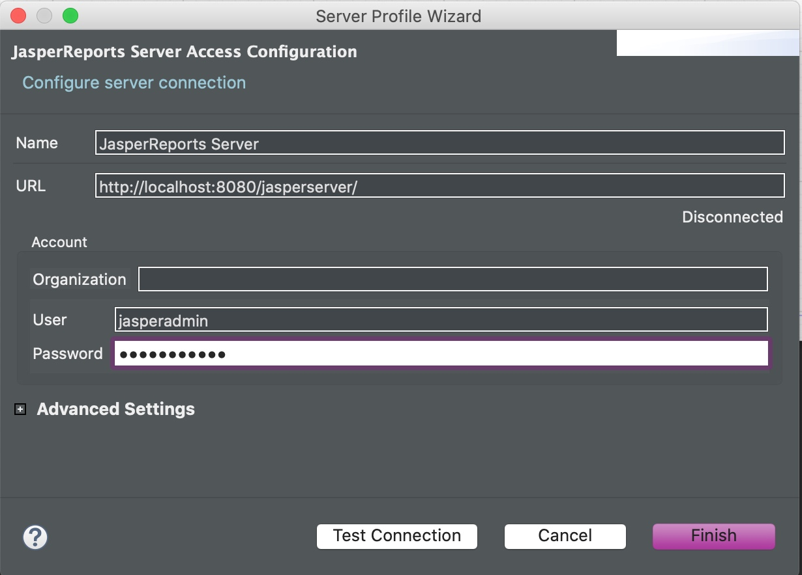
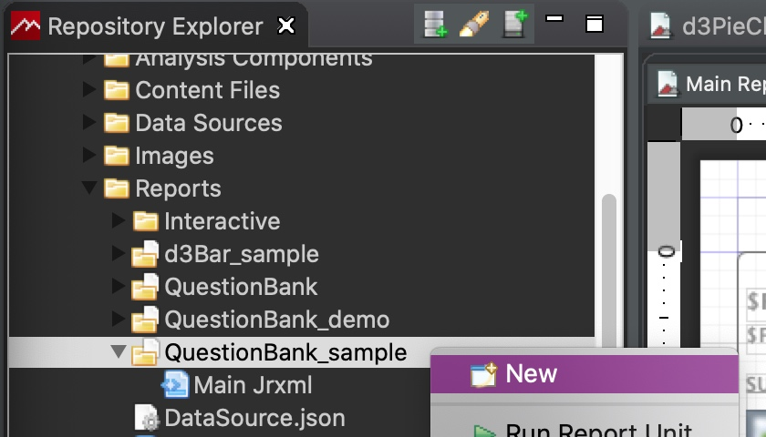

# Deployment instructions for Jasper reports with Custom Visualization Components (CVC)

## 1. Jasper Server Configuration

### 1.1. Create PhantomJS link

By default, PhantomJS is shipped with the Jasper Server bundle.
Check that PhantomJS is present in the following path (change according to the installed version):

~~~bash
ls /opt/jasperreports-server-cp-7.5.0/phantomjs
~~~

Create link to the bundled **PhantomJS** binary:

~~~bash
sudo ln /usr/bin/phantomjs /opt/jasperreports-server-cp-7.5.0/phantomjs/bin/phantomjs
~~~

Check that phantomjs can run by launching the phantomjs prompt:

~~~bash
root@ubuntu:~# phantomjs
phantomjs> 
~~~

Exit with Ctrl+C.

### 1.2. Install fontconfig package (Ubuntu)

On recent versions of Ubuntu the **fontconfig** package is required but not installed by default. Install with the following command:

~~~bash
sudo apt-get install fontconfig
~~~

### 1.3. Edit Jasper Server js.config.properties

Edit Jasper Server config, the **js.config.properties**:

~~~bash
sudo vim /opt/jasperreports-server-cp-7.5.0/apache-tomcat/webapps/jasperserver/WEB-INF/js.config.properties
~~~

Change the following line:

~~~bash
phantomjs.binary=/usr/bin/phantomjs
~~~

### 1.4 Edit jasperreports.properties

~~~bash
vim /opt/jasperreports-server-cp-7.5.0/apache-tomcat/webapps/jasperserver/WEB-INF/classes/jasperreports.properties
~~~

Add the following lines:

~~~bash
#PhantomJs
net.sf.jaspersoft.jasperreports.phantomjs.executable.path=/usr/bin/phantomjs
com.jaspersoft.jasperreports.components.customvisualization.phantomjs.executable.path=/usr/bin/phantomjs
~~~

Restart the server:

~~~bash
/opt/jasperreports-server-cp-7.5.0/ctlscript.sh restart
~~~

## 2. Deploy a report to Jasper Server using Jasper Studio

CVC are composed of two files: cs and a minified js file.
By default, Jasper Server does not accept js files when using the web ui. The simplest way to deploy a report containing a CVC is by using the Jasper Studio as when using this method there is no such limitation.

### 2.1 Add the Jasper Server connection

In the **Repository Explorer** tab, right click the **Server** node and **Create JasperServer Server Connection**:

### 2.2 Deploy the report to Jasper Server

Note that it is recomended to avoid using "-" character when naming Jasper Server resources.

Select **Upload from File System** and select the **jrxml** file for the main report.

Main report **jrxml** file is now deployed:

Continue with the other resource files: data source json files, data adapter xml file, css and js CVC files, template jrtx file.

For each CVC there are two files that must be uploaded:
css and a minified javascript.

Right click on the report folder on Jasper Server, click New and add the following resource types:
**Content Resource** for css, js, json
**Data Adapter File** for data adapter xml files
**Template** for jrtx files
**XML File** for anything else or if unable to upload using **Content Resource**.

Keep the same names and ids when defining Jasper Server resource so they match the naming of the local resources. 

The report with all the resource files deployed:

